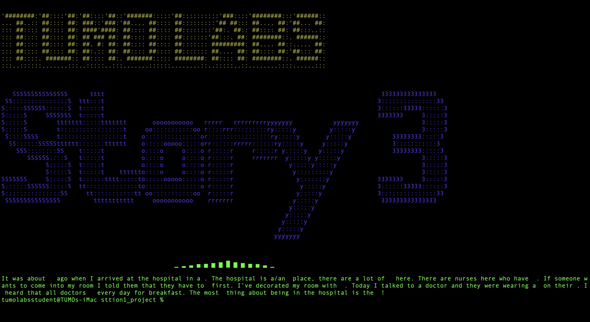

<a name="readme-top"></a>


[![LinkedIn][linkedin-shield]][linkedin-url]


<!-- PROJECT LOGO -->
<br />
<div align="center">
  <a href="https://github.com/vmkrtchy/sttion1_project">
    
  </a>

  <h3 align="center">Station Project 1 : Mad Libs</h3>


</div>


<!-- TABLE OF CONTENTS -->
<details>
  <summary>Table of Contents</summary>
  <ol>
    <li>
      <a href="#about-the-project">About The Project</a>
      <ul>
        <li><a href="#built-with">Built With</a></li>
      </ul>
    </li>
    <li>
      <a href="#getting-started">Getting Started</a>
      <ul>
        <li><a href="#installation">How To run</a></li>
      </ul>
    </li>
  </ol>
</details>


<!-- ABOUT THE PROJECT -->
## About The Project


<p align="right">(<a href="#readme-top">back to top</a>)</p>


### Built With
* [![Python3][Py]][Next-url]

<p align="right">(<a href="#readme-top">back to top</a>)</p>

<!-- GETTING STARTED -->
## Getting Started

This is an example of how you may give instructions on setting up your project locally.
To get a local copy up and running follow these simple example steps.

### Installation

This is an example of how to list things you need to use the software and how to install them.
* Library installation
  ```sh
  * pip3 install colorama
  * pip3 install termcolor
  * pip3 install pyfiglet
  ```

### RUN

_Below is an example of how you can run it
   ```sh
   git clone https://github.com/vmkrtchy/sttion1_project
   ```
2. Run in terminal
   ```sh
   python3 main.py
   ```


<!-- CONTACT -->
## Contact

Vahan Mkrtchyan - [@vmkrtchy](https://www.linkedin.com/in/vmkrtchy/) - tumolabs.jacke@gmail.com

Project Link: [https://github.com/vmkrtchy/sttion1_project](https://github.com/vmkrtchy/sttion1_project)

<p align="right">(<a href="#readme-top">back to top</a>)</p>


<!-- MARKDOWN LINKS & IMAGES -->

[linkedin-shield]: https://img.shields.io/badge/-LinkedIn-black.svg?style=for-the-badge&logo=linkedin&colorB=555
[linkedin-url]: https://www.linkedin.com/in/vmkrtchy/


[Py]: https://cdn.iconscout.com/icon/free/png-256/python-2752092-2284909.png
[Next-url]: https://www.python.org/


